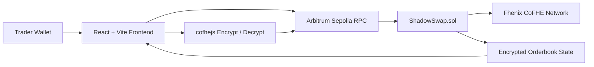

# ShadowSwap

ShadowSwap is a private orderbook DEX built on Fhenix CoFHE. Orders are encrypted in the frontend with `cofhejs`, submitted on-chain as confidential inputs, matched inside `ShadowSwap.sol`, and optionally revealed through the contract’s existing winner-reveal flow.

## Architecture



## Features

- Private order submission with encrypted `price` and `amount`
- Hardhat deployment task for `ShadowSwap`
- React frontend for wallet connect, order submission, matching, and reveal
- Status panel showing encrypted handles and revealed winner state
- CoFHE helper library for initialization, encryption, and decryption

## Project Layout

- `contracts/ShadowSwap.sol`: confidential orderbook contract
- `tasks/deploy-shadow-swap.ts`: Hardhat deployment task
- `frontend/`: Vite React app for wallet-driven CoFHE interaction

## Contracts

Install root dependencies and compile:

```bash
pnpm install
pnpm hardhat compile
```

Deploy to Arbitrum Sepolia after setting `.env`:

```bash
pnpm arb-sepolia:deploy-shadow-swap
```

Required root env values:

```bash
PRIVATE_KEY=0xyour_private_key
ARBITRUM_SEPOLIA_RPC_URL=https://sepolia-rollup.arbitrum.io/rpc
```

## Frontend

The frontend expects `frontend/.env`:

```bash
VITE_RPC_URL=https://sepolia-rollup.arbitrum.io/rpc
VITE_CONTRACT_ADDRESS=0xYourShadowSwapDeployment
```

Run it locally:

```bash
cd frontend
pnpm install
pnpm dev
```

Build verification:

```bash
cd frontend
pnpm build
```

## Runtime Flow

1. Connect wallet in the React app.
2. Encrypt `price` and `amount` with `cofhejs`.
3. Submit the encrypted order to `ShadowSwap`.
4. Call `matchOrders` to compute the encrypted winner.
5. Call `revealWinner` twice as needed to request and then fetch the decrypted winner.

## Notes

- Existing contract logic remains unchanged.
- The frontend is configured for Arbitrum Sepolia by default.
